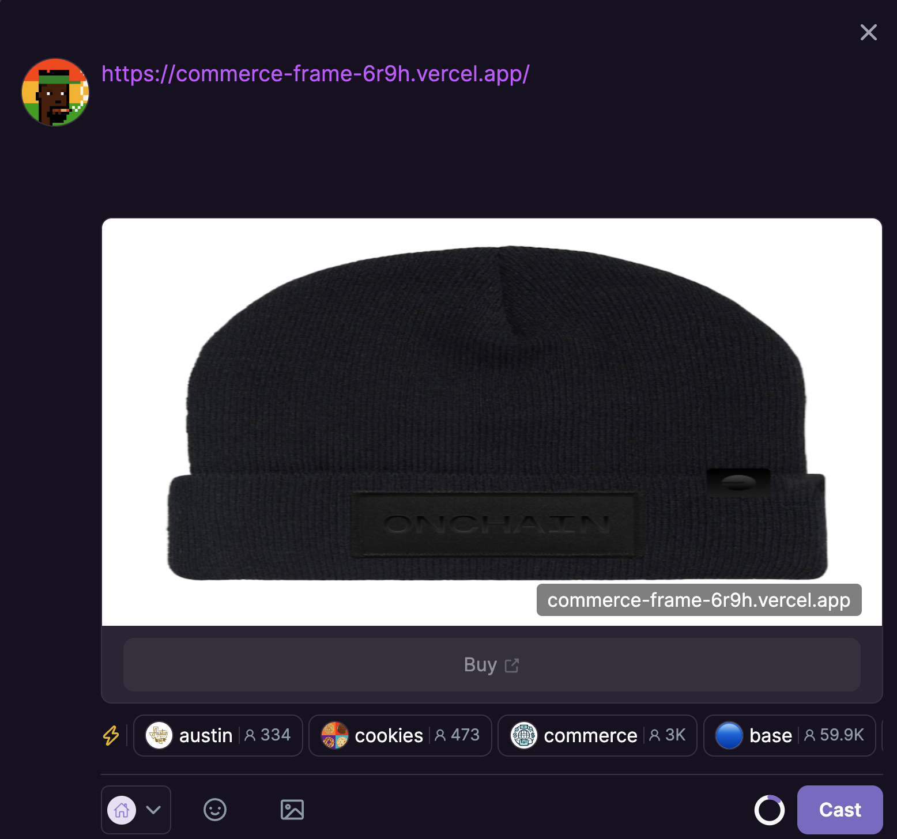

### Commerce x Farcaster Frames Single-Item Guide

This guide explain how to sell a single item using via a Cast which allows your users to pay with crypto via Coinbase Commerce.

## Pre-requirements

1. Create a Coinbase Commerce [account](https://beta.commerce.coinbase.com/sign-up)

> [!TIP]
> Be sure to set your [deposit address](https://beta.commerce.coinbase.com/settings/deposits) in the Coinbase Commerce merchant dashboard to avoid charge creation failures.

2. A custom domain. Optionally, create a vercel [account](https://vercel.com/signup) for easy deployment and testing

> [!IMPORTANT]
> Warpcast requires your Frame to be a `https://` URL

3. Create a Github [account] (https://github.com/signup)
4. An image of your item for sale (`.png`, `.jpg`) with 1200 x 630 pixel dimensions

## Start here

1. [Fork](https://docs.github.com/en/pull-requests/collaborating-with-pull-requests/working-with-forks/fork-a-repo?tool=webui#forking-a-repository) this repo
2. Connect your github account to Vercel. Reference the [official Vercel](https://vercel.com/docs/deployments/git#deploying-a-git-repository) guide for detailed steps
3. Upload your [Commerce API](https://beta.commerce.coinbase.com/settings/security) key credentials to Vercel settings page or your website hosting server. See the official Vercel guide on [environment variables](https://vercel.com/docs/projects/environment-variables) for detailed steps
   [!image](./public/env_credentials.png)

> [!TIP]
> For an app deployed at `https://sample-frame.vercel.app/` your settings page will be located at `https://vercel.com/your-projects/sample-frame/settings`

4. Open the forked repo from step 1 in a code editor like Visual Studio
5. Using a code editor or the command line, replace the temporary image in the `public/` folder with the image of your product
6. Navigate to the `utils/` folder (if using the command line run `cd utils/`)
7. Replace the following variables in the `utils.ts` file:

> [!IMPORTANT]
> Ensure your `NEXT_PUBLIC_URL` does not have a trailing `/`. Extra characters in the `post_url` will cause the redirect to fail.

- `NEXT_PUBLIC_URL` - Your website or vercel domain (ex: `https://your-site.com` or `https://sample-frame.vercel.app/`). You may find your vercel domain under your [Projects](https://vercel.com/hughescoins-projects) page
- `ITEM_DESCRIPTION` - A description of your product
- `ITEM_TITLE` - Title of your product
- `IMAGE_NAME` - The full name of your image including file type. (ex: `onchain.png`)
- (optional) `REDIRECT_URL` - A URL (`string`) to redirect users to upon purchase completion
- `PRODUCT_PRICE_USD` - The price (`string`) of your prouct in USD (ex: "5.99")

## Commit changes

```
git init
git add -A
git commit -m "first frame"
git branch -M master
git remote add origin git@github.com:Your-Github-Username/Your-Forked-Repo.git
git push -u origin master
```

## Add Cast your Frame:

1. Log into your [Warpcast](https://warpcast.com/)
2. Paste a link to your vercel site or custom domain _remember to use `https://`_
   
3. Click "Cast"

Enjoy!

# Additional tips

> [!TIP]
> Use the Frame [validator tool](https://warpcast.com/~/developers/frames) to view your frame and test functionality.

# A redirect frame example

Built using [a-frame-in-100-lines](https://github.com/Zizzamia/a-frame-in-100-lines) by [Zizzamia](https://github.com/Zizzamia)
and [redirect-frame](https://github.com/farcasterxyz/redirect-frame) by [Zizzamia](https://github.com/Zizzamia) and [Sanjay](https://github.com/sanjayprabhu)

## Resources

- [Official Farcaster Frames docs](https://warpcast.notion.site/Farcaster-Frames-4bd47fe97dc74a42a48d3a234636d8c5)

## License

This project is licensed under the MIT License - see the [LICENSE.md](LICENSE.md) file for details
